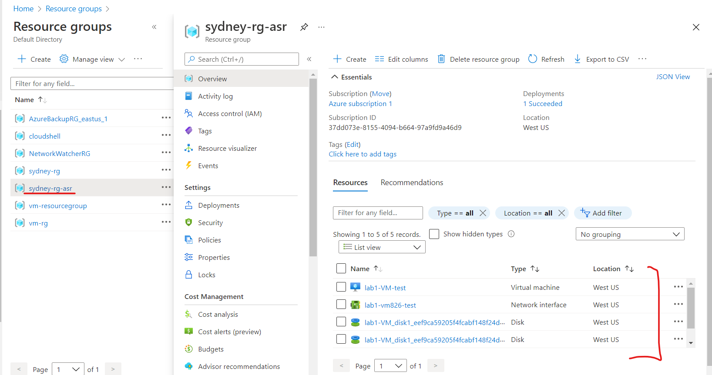

# Azure-Site-Recovery
Azure site recovery is our disaster recovery solution that allows us to automate the process of recovering from a primary location to a secondary location.

Azure Site Recovery Walkthrough
Step 1: Enable replication
Now are going to enable replication a virtual machine ‘lab1-vm’
Protect your Azure virtual machines for disaster recovery by replicating to another Azure region.
Here are my existing resources.

Now I am going to replicate my existing VM

Next, select ‘lab01-vm’. 
Note: We need to run the VM first.

Next, choose our target location, where do we want to replicate to in the event of a failover with this Azure Site Recovery.
It is going to create a target new resource group with a new vNet. It is also going to create a storage account to cache a data from the replicated VM to a managed disk so we can move that into a new location in the West US region.

We can customize Replication Policy if we want to recover at a point in time specifically such as app consistent snapshot frequency and recovery point retention. But we will leave of these there by default. Click Enable replication. It might take more than half an hour.

Sydney-rg-asr (Azure Site Recovery)

After Successfully completed the operation, go to the Azure Recovery Services vault and; on the Protected items select Replicated items, it shows the lab1-vm has been successfully replicated but as you see I got one Warning which means no successful test failover has been done on the virtual machine lab1-vm after it was replicated.
Therefore, I need to run a failover test and it is without impacting my current production operations.

Step 2: Run test failover
I click on the 3 dots on the right side next to Failover Health and choose Test Failover.

Test failover for the virtual machine has been successfully completed.

We can check in Site Recovery jobs will see our test failover status.

Next, we can clean up test failover and test failover virtual machine will be deleted.

Step 3: Run Failover
Note: we need to stop the virtual machine lab1-vm before running Failover.

Now my virtual machine lab1-vm is successfully failed over to the West US region.

From the Recovery Service vault, vault-sydney-vm01 | Replicated items, I click on lab1-vm then click ‘Commit’ the change. At this point, once I commit the Failover, I won’t be able to undo this. So I go ahead and click Ok.

My virtual machine lab1-vm is successfully failed over to the West US region. Now I am going to Failover it back to the original location which is East US region.
From the Recovery Service vault, vault-sydney-vm01 | Replicated items, I select ‘Disable Replication’

Now let’s go back to the virtual machine lab1-vm

At this point the machine was successfully failed over to the West US location, and the East location is still stopped. All traffic is now being routed to the server on the West US.
Now we will go through the process of starting the web server within the East US. We assume that at this point this time, the date center is back on line, everything is functioning. Now I just go ahead and start the virtual machine lab1-vm East US location.

The vm is successfully started and is running.

We can tell the difference because the lab1-vm in East US location was set up from the sydney-rg and then the another one was setup from the Sydney-rg-asr (Azure Site Recovery)

